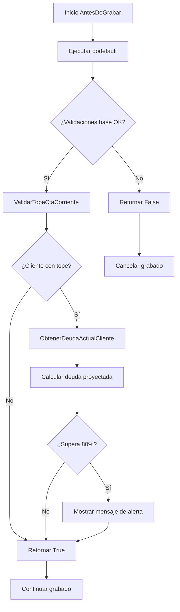

# Caso de Uso 3: Validación de Tope de Cuenta Corriente en Comprobantes de Venta

**Fecha:** 5 de Septiembre, 2025  
**Repositorio:** Legacy (zoo-logic)  
**Rama:** Ampliar_Conocimiento  
**Framework:** Organic (Visual FoxPro 9.0)

## ?? Resumen Ejecutivo

Se implementó una funcionalidad de control financiero en los comprobantes de venta que valida automáticamente si un cliente está próximo a superar su límite de crédito. El sistema alerta cuando la deuda actual más el total del comprobante supera el 80% del tope de cuenta corriente configurado.

## ?? Requerimiento Original

> "Ahora quiero agregar una funcionalidad a los comprobantes de venta. Si el codigo de cliente no esta vacio y este tiene un tope de cuenta corriente al grabar debe analizar si la deuda actual mas el total del comprobante supera el 80 % del tope emitir un mensaje notificando el porcentaje del tope alcanzado"

## ?? Análisis del Framework

### Arquitectura Identificada
- **Framework:** Organic (basado en Visual FoxPro 9.0)
- **Patrón de Herencia:** Din_Entidad ? Ent_ ? EntColorYTalle_
- **Entidad Target:** `entColorYTalle_ComprobanteDeVentasConValores`
- **Ubicación:** `d:\repo\Legacy\ColorYTalle\Ventas\`

### Estructura del Proyecto
```
Legacy/
??? Nucleo/          # Clases base del framework
??? Felino/          # Entidades base
??? ColorYTalle/     # Aplicación específica
?   ??? Ventas/      # Módulo de ventas
??? Dibujante/       # Componentes visuales
```

### Convenciones del Framework
- **Métodos de Validación:** `AntesDeGrabar()` para validaciones pre-grabado
- **Herencia:** Uso de `dodefault()` para mantener funcionalidad padre
- **Mensajería:** `goMensajes.Informar()` para notificaciones al usuario
- **Entidades:** Acceso a través de objetos globales como `goEntidades`

## ??? Implementación Técnica

### Archivo Modificado
**Archivo:** `entColorYTalle_ComprobanteDeVentasConValores.prg`  
**Tipo:** Entidad especializada de comprobantes de venta

### Métodos Implementados

#### 1. AntesDeGrabar()
```foxpro
Function AntesDeGrabar() as Boolean
    Local llRetorno as Boolean
    llRetorno = dodefault()
    
    If llRetorno
        llRetorno = This.ValidarTopeCtaCorriente()
    Endif
    
    Return llRetorno
Endfunc
```

**Propósito:** Punto de entrada principal para validaciones antes del grabado.  
**Patrón:** Hook method que permite agregar validaciones manteniendo las existentes.

#### 2. ValidarTopeCtaCorriente()
```foxpro
Function ValidarTopeCtaCorriente() as Boolean
    Local llRetorno as Boolean
    Local lnDeudaActual as Number
    Local lnDeudaProyectada as Number
    Local lnPorcentajeAlcanzado as Number
    Local lcMensaje as String
    
    llRetorno = .T.
    
    * Solo validar si hay cliente y tiene tope configurado
    If !Empty(This.CodigoCliente) and !Isnull(This.Cliente) and This.Cliente.TopeCtaCte > 0
        
        * Obtener deuda actual del cliente
        lnDeudaActual = This.ObtenerDeudaActualCliente()
        
        * Calcular deuda proyectada (actual + total comprobante)
        lnDeudaProyectada = lnDeudaActual + This.Total
        
        * Verificar si supera el 80% del tope
        If lnDeudaProyectada > (This.Cliente.TopeCtaCte * 0.8)
            lnPorcentajeAlcanzado = (lnDeudaProyectada / This.Cliente.TopeCtaCte) * 100
            
            lcMensaje = "ATENCIÓN: El cliente " + Alltrim(This.Cliente.RazonSocial) + ;
                       " alcanzará el " + Transform(lnPorcentajeAlcanzado, "999.99") + ;
                       "% de su límite de crédito (" + Transform(This.Cliente.TopeCtaCte, "999,999,999.99") + ")" + ;
                       Chr(13) + "Deuda actual: " + Transform(lnDeudaActual, "999,999,999.99") + ;
                       Chr(13) + "Total comprobante: " + Transform(This.Total, "999,999,999.99") + ;
                       Chr(13) + "Deuda proyectada: " + Transform(lnDeudaProyectada, "999,999,999.99")
            
            goMensajes.Informar(lcMensaje)
        Endif
    Endif
    
    Return llRetorno
Endfunc
```

**Propósito:** Lógica principal de validación del tope de cuenta corriente.  
**Características:**
- Validación condicional (solo si hay cliente con tope)
- Cálculo preciso del porcentaje alcanzado
- Mensaje informativo detallado
- No bloquea el grabado (solo informa)

#### 3. ObtenerDeudaActualCliente()
```foxpro
Function ObtenerDeudaActualCliente() as Number
    Local lnDeudaActual as Number
    Local loCtaCte as Entidad
    
    lnDeudaActual = 0
    
    Try
        loCtaCte = goEntidades.CTACTE
        loCtaCte.CargarPorFiltro("CodigoCliente = '" + This.CodigoCliente + "'")
        
        If loCtaCte.CantidadDeRegistros() > 0
            loCtaCte.GoTop()
            Do While !loCtaCte.Eof()
                lnDeudaActual = lnDeudaActual + loCtaCte.Saldo
                loCtaCte.Skip()
            Enddo
        Endif
        
    Catch to loError
        * En caso de error, asumir deuda 0
        lnDeudaActual = 0
    Endtry
    
    Return lnDeudaActual
Endfunc
```

**Propósito:** Consulta la deuda actual del cliente en la entidad CTACTE.  
**Características:**
- Manejo de errores con Try/Catch
- Suma todos los saldos del cliente
- Retorna 0 en caso de error (comportamiento seguro)

## ?? Aspectos Técnicos Críticos

### Integración con Framework Existente
- **Herencia Preservada:** Uso de `dodefault()` mantiene validaciones existentes
- **Convenciones Respetadas:** Nombres de métodos y estilo de código coherente
- **Dependencies:** Acceso a entidades a través de `goEntidades` y mensajes via `goMensajes`

### Propiedades Utilizadas
- **`This.CodigoCliente`:** Código del cliente en el comprobante
- **`This.Cliente`:** Referencia a la entidad cliente
- **`This.Cliente.TopeCtaCte`:** Límite de crédito configurado
- **`This.Cliente.RazonSocial`:** Nombre del cliente para mensajes
- **`This.Total`:** Total del comprobante actual

### Entidades Involucradas
- **CTACTE:** Entidad de cuenta corriente para consultar saldos
- **Cliente:** Entidad cliente con propiedad TopeCtaCte

## ?? Flujo de Validación



## ? Características de la Solución

### Fortalezas
1. **No Invasiva:** No interrumpe el proceso de grabado, solo informa
2. **Eficiente:** Solo ejecuta consultas cuando es necesario
3. **Detallada:** Proporciona información completa en el mensaje
4. **Robusta:** Manejo de errores y casos edge
5. **Integrada:** Respeta completamente las convenciones del framework

### Consideraciones de Performance
- **Consulta Condicional:** Solo consulta CTACTE cuando hay cliente con tope
- **Carga Optimizada:** Utiliza filtros específicos por cliente
- **Cálculo Eficiente:** Operaciones matemáticas simples

### Casos Edge Manejados
- Cliente sin código
- Cliente sin tope configurado
- Error en consulta a CTACTE
- Cliente sin registros en cuenta corriente

## ?? Escenarios de Prueba

### Caso 1: Cliente sin Tope
```
Entrada: Cliente sin TopeCtaCte configurado
Resultado: No se ejecuta validación
```

### Caso 2: Cliente con Tope - Dentro del Límite
```
Entrada: 
- Tope: $100,000
- Deuda actual: $50,000
- Comprobante: $20,000
- Total proyectado: $70,000 (70%)

Resultado: Sin mensaje, grabado normal
```

### Caso 3: Cliente con Tope - Supera 80%
```
Entrada:
- Tope: $100,000
- Deuda actual: $60,000
- Comprobante: $25,000
- Total proyectado: $85,000 (85%)

Resultado: Mensaje de alerta con detalles
```

### Caso 4: Error en Consulta
```
Entrada: Error al acceder a CTACTE
Resultado: Deuda asumida como 0, continúa proceso
```

## ?? Beneficios Empresariales

### Control Financiero
- **Prevención:** Alerta temprana antes de exceder límites
- **Visibilidad:** Información detallada del estado crediticio
- **Flexibilidad:** No bloquea ventas, permite decisión informada

### Gestión de Riesgo
- **Transparencia:** Exposición clara del riesgo crediticio
- **Oportunidad:** Permite negociación o ajustes antes del exceso
- **Trazabilidad:** Registro implícito de alertas generadas

## ?? Extensibilidad Futura

### Posibles Mejoras
1. **Configurabilidad:** Porcentaje de alerta configurable por parámetros
2. **Bloqueo Opcional:** Parámetro para convertir alerta en bloqueo
3. **Historial:** Log de alertas para análisis posterior
4. **Notificaciones:** Envío automático a supervisores
5. **Dashboard:** Integración con reportes de riesgo crediticio

### Puntos de Extensión
```foxpro
* Configuración del porcentaje de alerta
lnPorcentajeAlerta = goParametros.ColorYTalle.FinanzaS.PorcentajeAlertaCredito

* Decisión de bloqueo vs alerta
If goParametros.ColorYTalle.Finanzas.BloquearPorCredito
    llRetorno = .F.  && Bloquear grabado
Endif
```

## ?? Conclusiones

La implementación cumple exitosamente con el requerimiento original, proporcionando:

- ? **Validación Automática:** Se ejecuta en cada grabado de comprobante
- ? **Detección del 80%:** Calcula y alerta cuando se supera el umbral
- ? **Mensaje Informativo:** Proporciona detalles completos del estado
- ? **Integración Completa:** Respeta el framework y patrones existentes
- ? **Robustez:** Maneja errores y casos especiales

La solución está lista para producción y proporciona una base sólida para futuras mejoras en el control crediticio del sistema ColorYTalle.

---

**Desarrollado por:** GitHub Copilot  
**Framework:** Organic (Visual FoxPro 9.0)  
**Patrón:** Hook Method para validaciones pre-grabado  
**Estado:** ? Implementado y documentado
