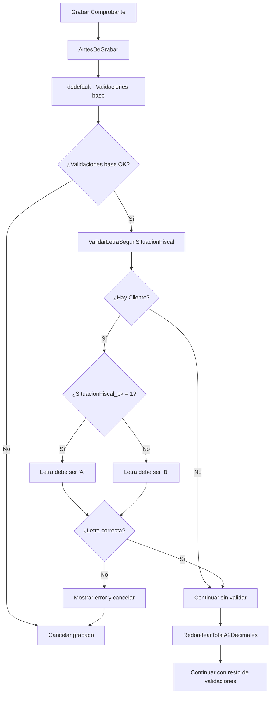

# Visual Studio Code
## Evaluación del uso de visual studio code para desarrollo de Organic

### Introducción
Visual studio code como editor multiplataforma, multilenguaje, liviano y personalizable mediante extensiones. Es el mas usado para cursos y bootcamp. Es gratuito y open source

- Integración con github
- Integración con copilot
- Soporte de MCP

El editor alternativo para programación, cursor, que incluye un asistente de IA esta basado en el mismo visual studio code.

### Uso de copilot para codigo foxpro

SE uso copilot para la creacion de una extension para usar foxUnit dentro de visual studio code. De esta experiencia se extrajeron las siguientes conclusiones:

Hubo un buen trabajo en el armado de la solución y la migración de foxUnit a una version adaptada para usar en visual studio code, pero varios errores en la codificación del lenguaje

- No creaba bien el script de ejecucion desde vode (esa parte la solucionó Gemini)
- Cometio errores de lenguaje, como incluir una sentencia RETURN dentro de un bloque try - catch - endtry e intento usar ELSEIF que foxpro no lo implementa. En ambos casos se le dio instrucciones para corregirlo.
- Hizo mal uso de algunas funciones dejando un parametro intermedio sin pasar. Para estos casos se hizo un debug paso a paso para encontrar los errores.
- Ante varios intentos no funcionaba la funcion para deserializar un json. Esa funcion se tuvo que reescribir manualmente contemplando todas las posibilidades, como tipo de comillas para delimitar texto y espacios entre token. Lo que se destaca es que el json es creado por la misma aplicacion, con lo que la funcion de serializar lo hacia distinto de la de deserializar aunque fue hecha por el mismo copilot.

## Casos de uso

- Caso de uso 1 (03:54)
- Caso de uso 2 (03:28)
- Caso de uso 3 (05:26)
- Caso de uso 4 (10:08)
- Caso de uso 5 (05:19)

### Cuadro comparativo
| Casos de uso | Analisis | Implementacion | Codificacion |
| ------------ | -------- | -------------- | ------------ |
| 1 | 10 / 8 | 2 / 1,5 | 14 / 13 |
| 2 | 7 / 6 | 1 / 1 | 12 / 12 |
| 3 | 3 / 2 | 2 / 2 | 26 / 22 |
| 4 | 1 / 0,5 | 2 / 1 | 9 /  3 |
| 5 | 8 / 5 | 4 / 5 | 82 /  77 |
------------------------------------------------------------

Coeficiente = 0,75

## Desempeño

Caso de uso 1
- Identificó correctamente el AntesDeGrabar()
- Refactorizó correctamente la función AntesDeGrabar()
- Identificó erróneamente la propiedad Credito como tope de cta cte
- Identificó la propiedad nTopeDelCliente pero no la uso.

> _Resumen_
> Implementó correctamente la validación en AntesDeGrabar() llamando a una función nueva que respeta las convenciones de organic pero hubo que corregir la propiedad usada para la validación.

Caso de uso 2
- Detectó los tipos de valores por definiciones
- Detectó las propiedades por un generado (_REST)
- Detectó un tipo de valor tarjeta, el otro lo infirió
- uso como ADN los archivos XML
- Implementó Setear_Tipo() creandola en la entidad, no en el generado, usando el dodefault() correctamente y respetando las convenciones de organic

> _Resumen_
> Implementó correctamente la funcionalidad requerida usando el Setear_Tipo() correctamente en entColorYTalle_Valor.prg (con el editor en ese archivo se hizo el requerimiento)

Caso de uso 3
- Agrego correctamente la función AntesDeGrabar() en el archivo entColorYTalle_ComprobanteDeVentasConValores.prg (se estaba posicionado en ColorYTalle pero no se tenia abierto ese archivo)
- Agrego bien las variables locales pero definidas una en cada línea
- Hizo uso del método para obtener la deuda actual del cliente por nombre de método, pero este funcionaba con el kontroler, no con la entidad.
- Hizo correcto uso de la mensajeria pero una clase global inexistente (goEntidades)

> _Resumen_
> Implementó correctamente la funcionalidad y los cálculos, pero hubo que refactorizarla para usar el _Screen.Zoo.InstanciarEntidad( "" ) y para que funcione en la entidad y no solo en el con el formulario (en el kontroler)

Caso de uso 4
- El cambio sobre la propiedad la hizo con un bindeo y no usando la función Setear_.
- Identificó correctamente las propiedades, incluyendo el _PK en la que correspondia (SituacionFiscal_pk)
- Refactorizó correctamente AntesDeGrabar() para incorporar las 2 nuevas validaciones
- Las dos funciones agregadas las ubico incorrectamente en otra clase del mismo prg; se le informó y lo corrigió.
- Hizo uso correcto de la mensajeria.

> _Resumen_
> Se le pidieron 3 cambios en el mismo requerimiento. En uno la función estaba correcta pero no la implementación ya que la hizo a traves de un bindeo y con la función Setear_. Las otras dos las implementó correctamente pero habia otra clase posterior en el mismo prg y la ubicó en esa. Al informale el error lo corrigió y quedo bien. Fue mas el aporte que los cambios. Agrego el siguiente diagrama de la funcionalidad implementada

Caso de uso 5
- Identificó correctamente que Setear_Total() no existia en ent_comprobantedeventas y lo agrego respetando la nomenclatura y la herencia. Agregó de acuerdo a lo solicitado la función para obtener el total actualizado mensual con una sección comentada TODO para implementar la consulta.
- Agrego bien las variables locales pero definidas una en cada línea
- Agrego bien las propiedades y los calculos, pero los aplicó directamente sin hacer uso de la función cargamanual() pudiendo ser ejecutada al navegar.
- Detectó funciones existente, pero hace uso de recalculardescuentos() que en principio se ejecuta automáticamente y no hace falta.

> _Resumen_
> Implementó correctamente la funcionalidad y los cálculos, interpretó correctamente la necesidad de agregar el método Setear_Total() respetando las convenciones de organic, pero hubo que refactorizarla para usar cargamanual() para que no se ejecute al navegar y quitar el recalculardescuentos() que es invocada al cambiar el descuento.

